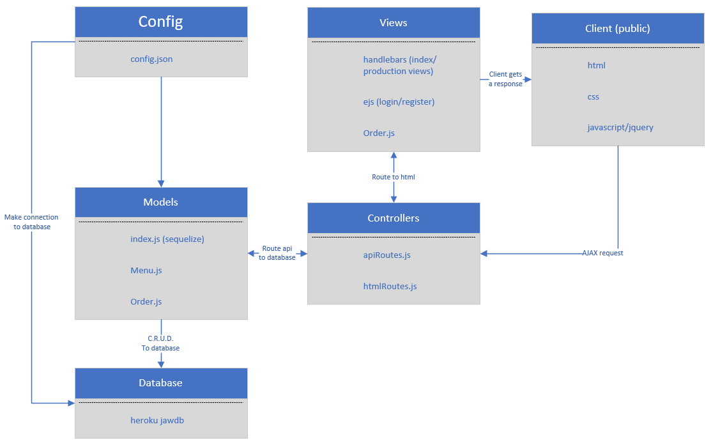

# Git Order
[](LICENSE)


## What is this repo?
Imagine you are at a restaurant or at home, making an order on your favorite dish. You've waited and waited but the food still hasn't come yet. You're hesitating to keep asking the water. Well, we have a solution for that. Git Order App!

This app contains a list of menu, where the user can select the quantity and make an order. The user can see the order status. The admin can login the portal and manage the order status to give the user an update on the order status. 

This is a great learning tool for beginner software engineer to understand the concept of MVC (Model-View-Controller) and to query mysql data. It also provides a simple example of passportjs.

 

## How is this repo useful?
This is a great learning tool for node js/javascript/mySQL/Express-handlebars/Express beginners to get acquainted with the following concepts:

* Learn about mysql driver in Node js. 
    * [mysql package](https://www.npmjs.com/package/mysql)
* Learn about Express JS.
    * [express package](https://www.npmjs.com/package/express)
* Learn about Express-handlebars.
    * [express-handlebars package](https://www.npmjs.com/package/express-handlebars)
* The script is written in Node JS.
    * [Node JS](https://nodejs.org/en/)
* Learn about EJS.
    * [EJS](https://www.npmjs.com/package/ejs)
* Learn about BRYPT.
    * [BCRYPT](https://www.npmjs.com/package/bcrypt)
* Learn about Express-flash.
    * [express flash](https://www.npmjs.com/package/express-flash)
* Learn about Express-session.
    * [express session](https://www.npmjs.com/package/express-session)
* Learn about Method-override.
    * [method override](https://www.npmjs.com/package/method-override)
* Learn about mysql2.
    * [mysql2](https://www.npmjs.com/package/mysql2)
* Learn about passport.
    * [passport](https://www.npmjs.com/package/passport)
* Learn about sequelize.
    * [sequelize](https://www.npmjs.com/package/sequelize)

## How to get Started?
1. clone the repository:
```git
git clone git@github.com:tmnguyen8/Git-Order.git
```
* If your node js and npm installed, you can skip this step.
  * [Downloading and installing Node.js and npm](https://docs.npmjs.com/downloading-and-installing-node-js-and-npm)

2. Install the packages:
Navigate to your directory where this repo lives on your local machine and install the following packages:
```git
npm install
```

3. Create a database:
Create a localhost database for testing the app on your machine. The schema and seeds files are located in the following directory. Add a user name and password.


4. Deploy to Heroku and add JawsDB MySQL:
Create a localhost database for testing the app on your machine. The schema and seeds files are located in the following directory. Make sure you have a verified account with Heroku. Credit card will be required but as long as you select the free option, you will not be charged. Under Heroku app resources, look for JawsDB mySQL and add the add-ons to your app. 

    * [Deploy to Heroku](https://devcenter.heroku.com/articles/heroku-cli)


## How does this work?
1. The user has the functionality of creating an order with the quantity that he/she wants. The user can also view the orders and the status.

[User Page](https://git-order.herokuapp.com/)

2. The admin registers an account and login to the production portal to make changes to the order status or delete the order.

[Admin Page](https://git-order.herokuapp.com/production)


